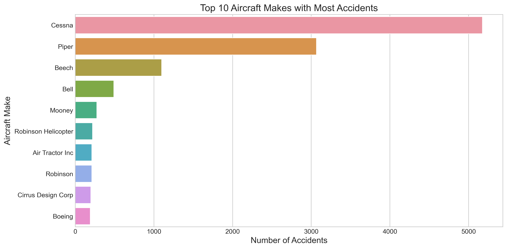
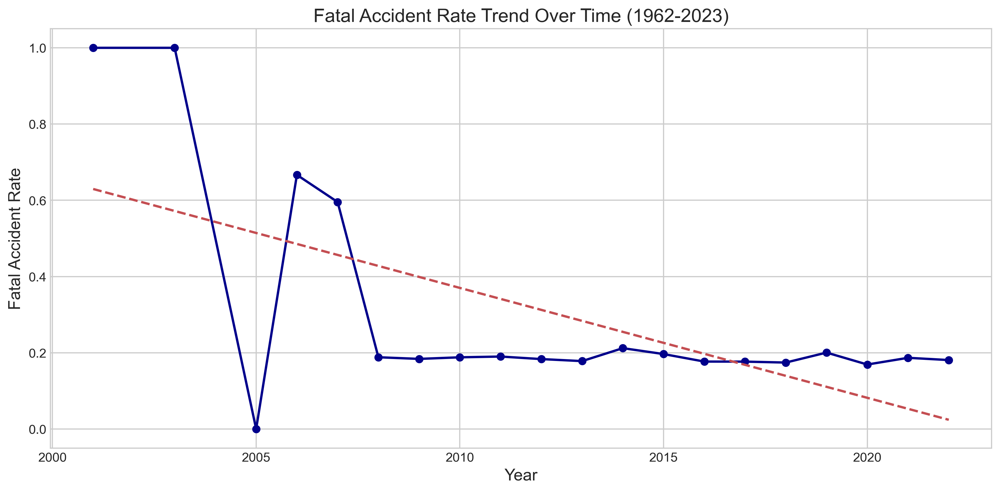
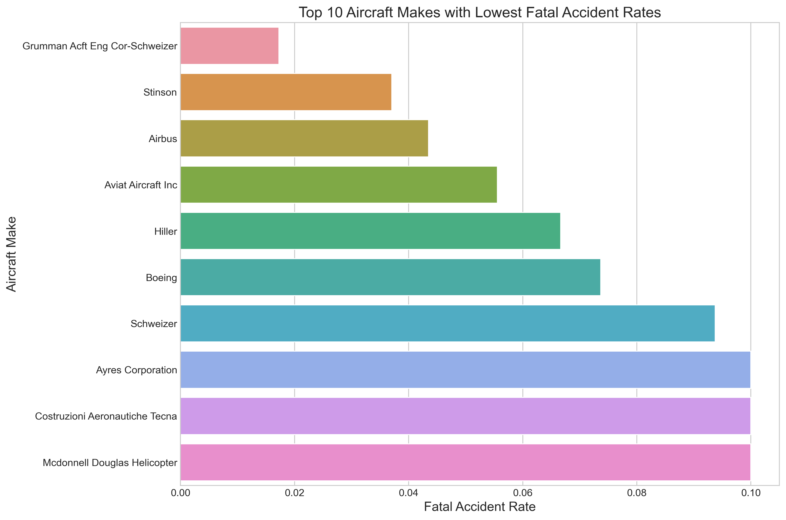
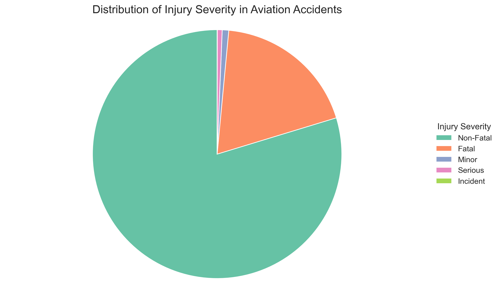
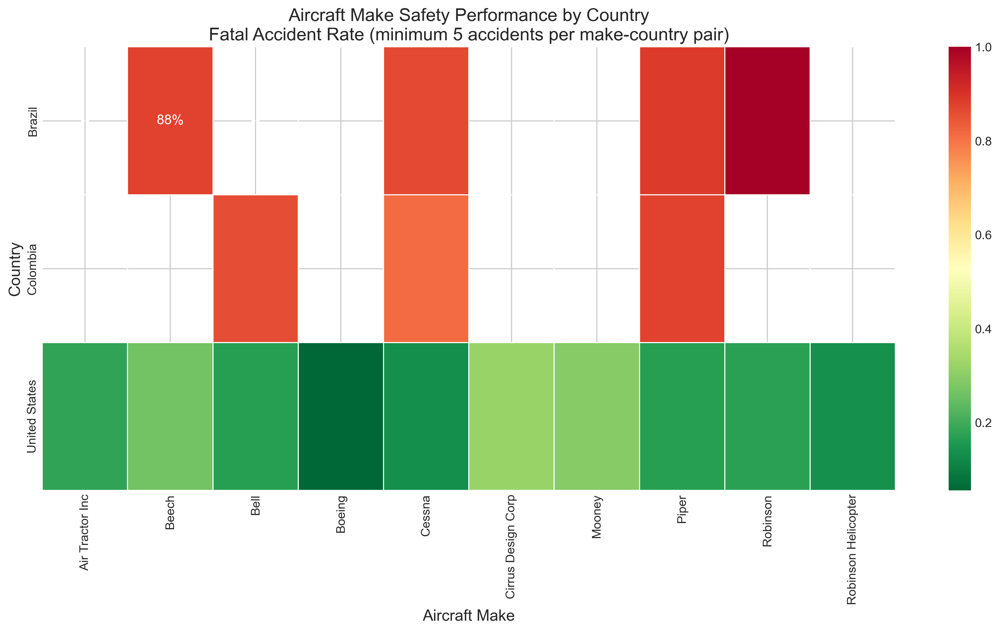
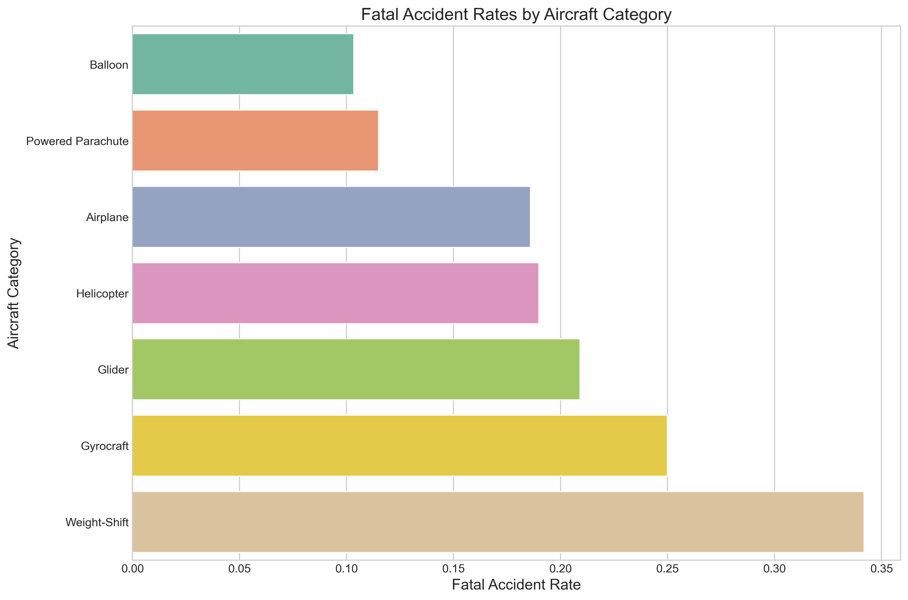
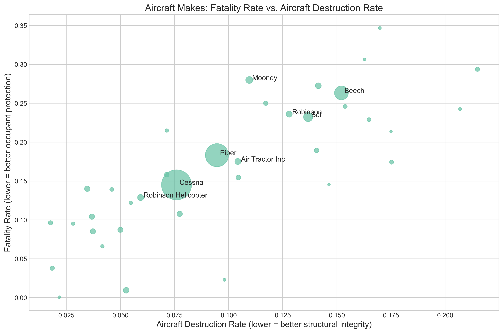
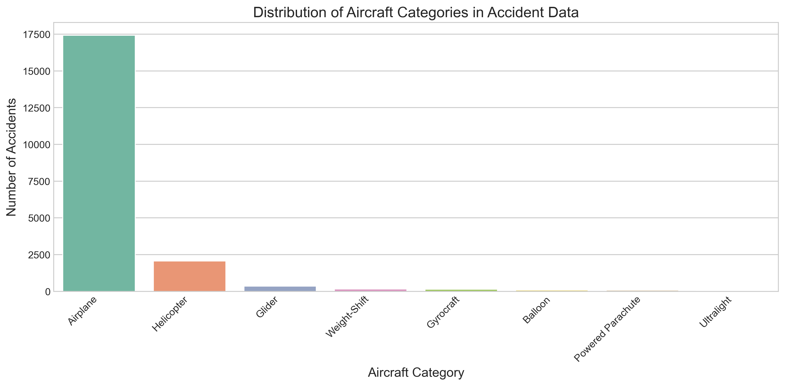
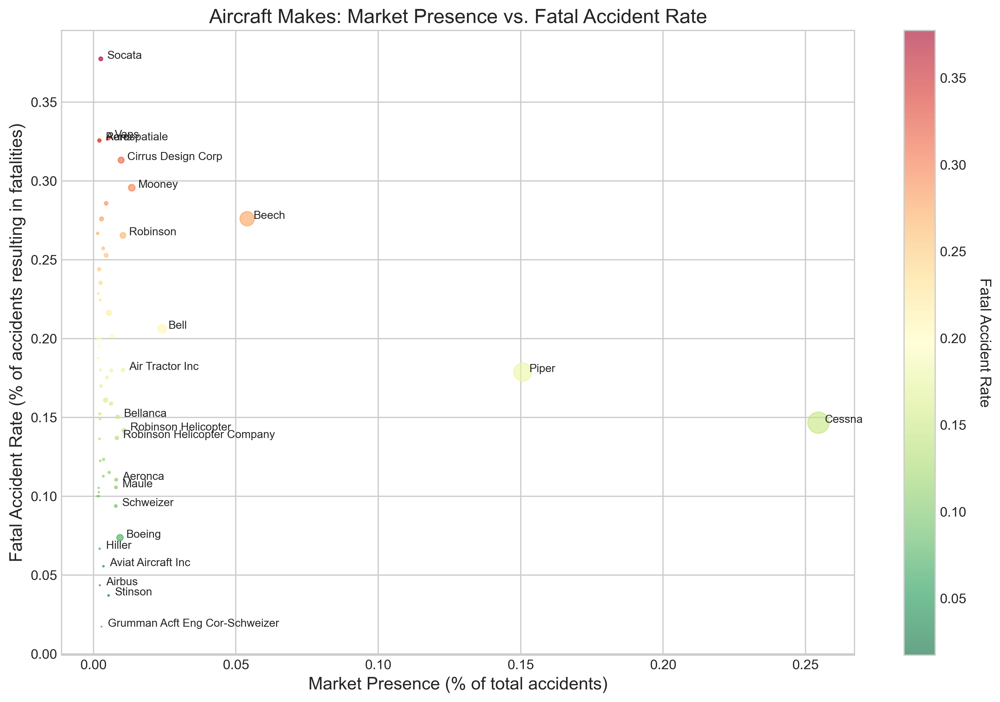

## Final Project Submission

Please fill out:
* Student name: George Kariuki
* Student pace: part time 
* Scheduled project review date/time: 29/04/2025
* Instructor name: George Kamundia
* [Github repo URL](https://github.com/g-eez/dsc-phase-1-project.git)
* [Tableau dashboard URL](https://public.tableau.com/app/profile/george.kariuki8016/viz/projectdashboard_17459601890850/Sheet4?publish=yes)

# Software Requirements

- **Python 3.8+**
- **Jupyter Notebook**
- **Required Libraries**: pandas, numpy, matplotlib, seaborn
- **Data**: Aviation_Data.csv
- **System**: 4GB RAM minimum

# 1. Business Understanding

## Project Context

Wilson Airport is expanding its operations to include aircraft acquisition for commercial and private aviation services in North and South America. However, before investing billions of kenyan shillings into purchasing aircraft, the airport's Board of Directors requires a comprehensive risk assessment based on historical safety data.

The primary objective of this project is to leverage historical aviation accident data (1962–2023) to identify **low-risk aircraft makes and models** that would be suitable for purchase. The findings of this analysis will directly influence Wilson Airport's procurement strategy and fleet composition.

As data scientists, our role is to provide **data-driven insights** that support **strategic decision-making**, reduce **investment risk**, and promote **operational safety**.

## Business Questions

The business questions we are tasked to address are:

1. **Which Aircraft Makes and Models Have the Lowest Accident and Fatality Rates?**  

2. **Are Newer Aircraft Models Statistically Safer Than Older Models?**  

3. **Which Aircraft Categories and Configurations Should Be Preferred or Avoided?** 

4. **Which Aircraft is Best Suited for a Specific Country?**:  

5. **Which Aircraft Handles Injuries and Damage Better?**:

# 2. Data Understanding

In this section, we aim to build a strong understanding of the aviation accident dataset.  
Before any cleaning, transformation, or analysis can take place, it is critical to:

- Explore the **overall structure** of the data.
- Assess the **completeness and quality** of the data.
- Understand the **meaning and role** of key columns.
- Detect any **missing values**, **strange data types**, or **anomalies**.
- Identify **time coverage** and any potential **bias** in the dataset.

**The specific steps we will follow:**

1. **Import libraries** required for data manipulation and visualization.
2. **Load** the dataset into a pandas DataFrame
3. **Inspect** the dataset’s structure (columns, data types, non-null counts).
4. **Preview** sample records to understand typical entries.
5. **Summarize** the dataset with basic descriptive statistics.
6. **Check for missing values** across all columns.
7. **Investigate key features** such as:
   - Aircraft Make
   - Aircraft Model
   - Event Date
   - Injury Severity
   - Aircraft Category
8. **Review time coverage**: What time range does the dataset cover?
9. **Identify data quality issues**, inconsistencies, or potential cleaning needs.
10. **Document** initial findings that will inform data cleaning and preparation steps later.

> Data understanding is a foundation of all strong data science projects. Skipping this phase risks introducing errors, misinterpretations, and poor business recommendations.

# Data Preparation (Cleaning the Data)

## Remove Duplicate Rows

* Ensure each accident record is unique to prevent skewing results.
* Use:

    ```python
    df.drop_duplicates(keep='first', inplace=True)
    ```
* Track the number and percentage of duplicates removed.

## Handle Missing Data in Key Columns

* Focus only on columns essential to business insights:

    ###   Geographic Analysis

    * `Latitude`, `Longitude`: Create a binary column `Location.Available` and filter rows where both are available (i.e., both latitude and longitude are not missing).
    * `Country`, `Location`: Drop or impute if missing (not critical for analysis but helpful for geographical insights).

    ###   Aircraft Characteristics

    * `Make`, `Model`: Drop rows with missing values as these are key to understanding aircraft data.
    * `Aircraft.Category`: Drop rows with missing data since it’s important for category-based analysis.

    ###   Severity and Injury Analysis

    * `Injury.Severity`: Drop records with missing severity, as it's a key factor for any injury-related analysis.
    * `Total.Fatal.Injuries`, `Total.Serious.Injuries`, `Total.Minor.Injuries`, `Total.Uninjured`: Drop rows with missing values to ensure valid analysis of injury counts.

    ###   Operational Context

    * `Broad.phase.of.flight`: This column is not essential for core analysis, so it was excluded.
    * `Weather.Condition`: Drop rows with missing weather conditions to ensure the validity of weather-related analysis.

    ###   Aircraft Damage

    * `Aircraft.damage`: Drop rows with missing values as it’s crucial to correlate damage with injuries.

## Convert Data Types

* Convert `Latitude` and `Longitude` to `float64`, ensuring they are within valid geographic ranges.
* Ensure `Event.Date` and `Publication.Date` are in `datetime64[ns]` format.
* Convert injury and engine count fields to numeric types (either `float64` or `int64`).

## Standardize Categorical Values

* `Make`: Normalize case (e.g., "CESSNA", "Cessna" → "Cessna").
* `Injury.Severity`: Simplify into standard levels (e.g., "Fatal", "Non-Fatal", "Incident").
* `Aircraft.Category`: Normalize and group rare values as "Other".
* `Broad.phase.of.flight`: Group into broad categories (e.g., Takeoff, Cruise, Landing) if relevant.

## Validate Data Consistency

* Cross-check injury counts against `Injury.Severity`.
* Validate engine count against aircraft category.
* Ensure there are no contradictory values (e.g., "Fatal" with all injury counts = 0).

## Final Processing

* Reset index after all cleaning:

    ```python
    df.reset_index(drop=True, inplace=True)
    ```
* Output cleaned row count and summary statistics.
* Prepare the cleaned dataset for visualization and analysis.

# Data Analysis


## 1. Foundation Visualizations

- **Distribution of Injury Severity** (Pie Chart)
- **Top Aircraft Makes in Accident Data** (Bar Chart)
- **Aircraft Categories in Accident Data** (Bar Chart)

## 2. Business Question Analysis

### 2.1 Which aircraft makes and models have the lowest accident and fatality rates?
- **Comprehensive Safety Ranking Chart** (Horizontal Bar Chart)
  - Show top 15 safest aircraft makes ranked by fatal accident rate
  - Include total accidents, fatal accident count, and fatal accident rate
  - Filter for statistical significance (minimum 30 accidents)
  - Insight: Identify specific manufacturers with proven safety records

### 2.2 Are newer aircraft models statistically safer than older models?
- **Safety Trend Timeline Visualization** (Line Chart with Annotations)
  - Show fatal accident rates over decades (1960s-2020s)
  - Compare safety metrics between older and newer aircraft generations
  - Include confidence intervals to show statistical significance
  - Insight: Quantify safety improvements in modern aircraft

### 2.3 Are there specific types or categories of aircraft that should be preferred or avoided?
- **Aircraft Configuration Safety Matrix** (Color-Coded Grid/Heatmap)
  - Compare aircraft categories and configurations (single vs multi-engine, etc.)
  - Color code by fatal accident rate 
  - Size indicators for data volume/confidence
  - Insight: Identify optimal aircraft configurations for different uses

### 2.4 Which aircraft is best suited for a specific country?
- **Country-Specific Safety Performance Map** (Geographic Heatmap with Top Performers)
  - Map showing safety performance of aircraft makes by region
  - Callout boxes highlighting top 3 safest aircraft for regions of interest
  - Insight: Identify regional safety variation in aircraft performance

### 2.5 Which aircraft handles injuries and damage better?
- **Survivability Quadrant Analysis** (Scatter Plot with Quadrants)
  - X-axis: Structural integrity (aircraft destroyed rate)
  - Y-axis: Occupant protection (survival rate in accidents)
  - Quadrants clearly indicate best performers in both dimensions
  - Insight: Identify aircraft that protect both structure and occupants

## 3. Integrated Findings

### 3.1 Optimal Aircraft Selection Matrix
- Consolidate findings across all questions
- Create weighted scoring system incorporating all safety dimensions
- Identify clear winners that satisfy multiple safety criteria

### 3.2 Strategic Recommendations
- Top 3 aircraft makes/models for Wilson Airport based on comprehensive analysis
- Specific operational recommendations based on flight phase findings
- Training and safety system priorities

## 4. Executive Summary

### 4.1 Key Insights
- Single-page visual summary of critical findings
- Actionable takeaways for immediate implementation

### 4.2 Procurement Guidance
- Clear, data-backed recommendations for aircraft acquisition
- Risk assessment framework for future decisions

# Data Visualizations











# Key Aircraft Safety Recommendations for Wilson Airport

## 1. Safest Aircraft Makes
**Recommendation**: Prioritize **Grumman**, **Stinson**, and **Airbus** aircraft for procurement.
* These manufacturers demonstrate the lowest fatal accident rates (2-4.3%)
* Establish procurement guidelines favoring these proven safer options

## 2. Aircraft Age Strategy
**Recommendation**: Focus on aircraft manufactured after 2005.
* Safety metrics improved dramatically around 2005
* Models from 2008 onward show similar safety profiles, allowing cost-effective selection of slightly older aircraft

## 3. Optimal Aircraft Categories
**Recommendation**: Match categories to specific operations.
* Use **Balloons** (10% fatal accident rate) for tourism
* Select conventional **Airplanes** (18%) for commercial operations
* Avoid **Weight-Shift** aircraft (34%) when possible

## 4. Regional Considerations
**Recommendation**: Select aircraft with proven performance in African conditions.
* Prioritize makes with established maintenance networks in Kenya
* Consider aircraft that perform well in similar climate/altitude conditions
* Consult with regional operators about real-world performance

## 5. Survivability Focus
**Recommendation**: Prioritize aircraft like **Cessna** that protect occupants during accidents.
* Consider both accident prevention and survivability metrics
* Select models with demonstrated cabin integrity during incidents
* Implement enhanced safety protocols for higher-risk aircraft when operationally necessary